# Self-hosted architecture readiness

The [HB-8 external-source review](../reviews/HB-8-external-design/findings.md) adds six open capability-contract refinements and their closure sequence. It does not select technologies or close the planning gate.

The [HB-10 re-review](../reviews/HB-10-unresolved/findings.md) assesses all thirteen PC/ED findings after HB-9; none is closed or approved as a scoped deferral. Use the [recent owner register](../planning/recent-owner-requirements.md) for discussion additions and outstanding choices, pending PP-08 canonical trace integration.

Tracking: [HB-7](https://linear.app/hybrid-billing/issue/HB-7/define-the-architecture-readiness-specification-and-development-plan). Accountable owner: Seung Woo Park. Root owns PM, planning and document edits; independent architect, DBA and QA reviewers assess the design. Machine: `mac_mini`.

## Requirement and decision status

**Owner-confirmed:** self-hosted delivery; assess ClickHouse, Kafka and OpenTelemetry; include data modeling, database selection, session/token/authentication/authorization policy, administration and customer/user information management, MSP/customer tenancy and organization management, explicit role-based access, API/upload and other collection methods, provider/customer grouping, and an intelligence layer for validation, correction, adjustment and prediction. These are additions from the current discussion, not retroactive claims about the original v1.16 source.

**Existing local planning basis:** v1.16 describes MSP, enterprise and corporate-group operating profiles; provider costs, customer selling prices and internal allocations are distinct. The earlier local plan recorded more than one million incoming records/day. Owner direction on 2026-10-08 supersedes that sizing premise with **more than 100 million incoming records/day**; a 30-day window at 100 million/day already contains 3 billion records before expansion. This is not performance certification or an upper bound. See the [HB-20 cost data review](data-ownership/cost-analytics-data-design.md). Local source: `docs/planning/v1.16/{domain-contracts,architecture,delivery-plan,retention-access,payment-terms,erp-recognition-cadence,ui-design,scale-validation}.md`. These companion artifacts remain unpublished; a fresh clone cannot validate all source traceability yet.

**Proposed:** modular business core with separately scalable workers, transactional authority, immutable evidence and derived analytics. PostgreSQL is the first transactional candidate. ClickHouse, Kafka, identity products, deployment tooling, languages and model providers are unselected. No server sizing or schedule is approved.

**Gate:** product development remains prohibited until the owner explicitly declares planning complete. This package creates no product code, DDL, scaffolding, executable prototype or deployed infrastructure. Merge does not open that gate. The [seven HB-6 content findings](../reviews/HB-6-content/findings.md) remain open; this package does not remediate them or certify complete planning.

## Design package

| Document | Owned design scope |
| --- | --- |
| [Technology assessment](technology-assessment.md) | Database, broker and telemetry suitability; adoption evidence |
| [Installation assessment](self-hosted-installation-assessment.md) | Kubernetes/VM comparison, separate stateful placement, ownership and planned operational acceptance |
| [Billing data model](data-ownership/billing-data-model.md) | Canonical entities, relationships, tenancy, organization and integrity |
| [Data collection](data-collection.md) | API/push/export/upload methods, source authority and provider/customer grouping |
| [Identity and permissions](security-boundaries/identity-session-permissions.md) | Login, sessions, tokens, revocation and scoped authority |
| [Admin design](admin-design.md) | Installation, tenant/customer and financial operations |
| [Intelligence layer](intelligence-layer.md) | Validation, correction/adjustment proposals and forecasts |
| [Usage detail lifecycle](usage-detail-lifecycle.md) | Complete cost/usage explanations, pricing/charge finalization and durable history/export/archive/recovery |

## Proposed logical architecture

```mermaid
flowchart LR
  SRC[Approved provider files APIs and metering] --> ING[Ingestion adapters]
  ING --> RAW[(Immutable permitted evidence)]
  RAW --> VALID[Normalize and validate]
  VALID --> DATA[Versioned detail and input manifests]
  DATA --> CALC[Deterministic allocation and calculation]
  CALC --> REVIEW[Reconcile and review]
  ADMIN[Admin and customer portal] --> API[Authenticated scoped command API]
  API --> LEDGER[(Transactional business authority)]
  REVIEW --> LEDGER
  LEDGER --> OUTBOX[Durable outbox and jobs]
  OUTBOX --> ERP[ERP or controlled file adapter]
  ERP --> CHECK[External confirmation and reconciliation]
  CHECK --> LEDGER
  OUTBOX -. optional .-> BUS[Kafka delivery and replay]
  BUS --> ANALYTICS[ClickHouse candidate projections]
  DATA --> ANALYTICS
  ANALYTICS --> INTEL[Intelligence analysis]
  INTEL --> PROPOSAL[Evidence-linked proposals and forecasts]
  PROPOSAL --> API
  API -. redacted telemetry .-> OTEL[OpenTelemetry observability]
```

These are logical roles, not one service or database per box. Evidence publication verifies completed bytes and manifests before exposing inputs. Cross-store arrows are not distributed atomic transactions. Kafka is optional delivery infrastructure; the same durable outbox can feed a controlled direct publisher. Every projection records source revision, completeness and freshness; unresolved publication or lag cannot authorize billing. Workers and adapters also emit redacted telemetry; security/business audit has separate durable authority.

## Self-hosted operating specification to complete

| Area | Required specification and owner | Current status |
| --- | --- | --- |
| Installation profile | Document the full planned MSP/enterprise/group and provider/ERP matrix; owner resolves missing tenant-count and isolation evidence without reducing design scope | UNRESOLVED |
| Runtime | Operations owner compares containerized VM installation and customer-managed Kubernetes; supported OS/CPU/runtime and disconnected package delivery | PROPOSED alternatives; VMware is not a prerequisite |
| Network | Operations/security owner defines ingress TLS, internal endpoints, provider/ERP/IdP/model egress allowlist, proxies, DNS and clock synchronization | UNRESOLVED; no automatic vendor data export |
| Storage | DBA/operations specify authoritative DB, evidence persistence, encryption/key custody, capacity growth, archive and backup destinations | Logical roles defined; products and physical layout UNRESOLVED |
| Availability | Owner sets SLO, ingestion/closing windows, RPO/RTO, failure domains and maintenance windows | UNRESOLVED; no single-node production or HA certification |
| Secrets and identity | Security owner defines customer-owned secret storage, CA/key rotation, IdP/LDAP products, break-glass and bootstrap custody | Design in identity document; exact products UNRESOLVED |
| Lifecycle | Operations owner defines version-pinned signed packages, compatibility matrix, migration/preflight/rollback, support diagnostics and recovery rehearsal | Planned; no installer or upgrade executed |
| People and cost | Owner names implementation, finance, security, DBA and operations capacity, skills, hardware/software budget and delivery constraints | No staffing, budget or dates supplied |

Self-hosted does not mean air-gapped, one legal entity, single tenant or unlimited hardware. A customer-supplied DB/broker/store requires a compatibility and responsibility matrix. Application upgrade cannot silently upgrade customer infrastructure. Backups include DB plus referenced evidence, model/policy versions and authoritative deletion/revocation decisions. Restore first isolates old writers and external credentials, verifies the latest control watermark and reconciles uncertain ERP outcomes before reopening.

## Capacity worksheet and validation

Collect records/day, peak records/second and peak duration; mean/p95/max permitted row bytes; source-to-normalized/calculated row expansion; contract/customer skew; retention by class; correction/replay horizon; concurrent users/queries/jobs; source rate limits; closing window; disk/network performance and available operator capacity. Count telemetry separately from billing records.

For planning, `raw bytes/day = input records/day × mean permitted bytes/record`. Derive detail, index, replication, WAL, temporary merge space and backups separately using measured ratios. Required catch-up throughput includes ongoing arrivals plus backlog divided by the agreed recovery window. 100 million/day averages about 1,157.4 records/second; that average cannot specify burst, monthly scans or node count.

After development is authorized, compare candidates on the same synthetic workload and immutable input revision. Required scenarios: sustained arrival, concentrated bursts, concurrent monthly closing, catch-up, tenant skew, correction/replay, disk/full/replica failures, backup restore, deletion, revoked access and ERP unknown outcomes. Record CPU/RAM/disk/network, version/configuration, counts/bytes, p95/p99 latency, backlog age, locks/WAL/merge pressure, full currency totals and recovery behavior. All runtime scenarios are currently **NOT_RUN**.

## Dependency-based development sequence

| Stage | Work and dependencies | Exit evidence and responsibility |
| --- | --- | --- |
| P: planning closure | Complete HB-6 PP-02–06 content remediation; use this package as input to PP-07; reconcile the English baseline under PP-08; independent PP-09 review | Root PM integrates evidence and unresolved decisions; owner separately declares planning complete |
| A: support and contract freeze | After P: tenant/identity/decimal/time/source/Claim/ERP/retention contracts, evidence-backed activation profiles within the full design scope and measurable capacity/recovery targets | Architect/DBA/security independent review; finance owner confirms accounting and pricing policies |
| B: installation and ingestion slice | A; reproducible self-hosted installation, authentication/tenant boundaries, the full collection contract, with each real source path activated only on its own approved evidence, immutable evidence and durable jobs | Implementer; independent QA/DBA demonstrate full data coverage, isolation, replay and restore; run early storage/broker comparisons |
| C: calculation and reconciliation | B plus numeric/contract policies; canonical revisions, allocation, independent oracles, admin review flows | Billing implementer; DBA/QA verify conservation, deterministic results, credit concurrency and approved revisions |
| D: approval and external handoff | C plus actual ERP capabilities; numbering/Claims, controlled files, purpose-specific ERP submissions, Payment Terms and monthly recognition | ERP implementer; finance/QA validate external uncertainty, no duplicate issuance or recognition and two-period reconciliation |
| E: operational and intelligence completion | Admin/security functions begin in B; intelligence depends on trustworthy B/C manifests and approved policies | UI/analysis implementer; QA verifies operator workflows, explainable proposals, no ledger bypass and forecast backtests |
| F: customer-supported release | Selected paths through B–E; supported combinations and agreed operational capacity | Independent integration/security/finance/operations evidence, recovery rehearsal and owner release decision |

Stages describe planned responsibility, not assigned developers or live child tickets. Create real matching Linear tickets and branches before each execution; define owned files and independent review. Do not implement all stages under HB-7 or fabricate issue IDs. Calendar estimates follow named staffing, support scope and measured experiments.

## Decisions required next

Apply the [HB-11 supplied contracts and decision packets](../reviews/HB-11-refinements/resolution.md) before final scope/contract acceptance. All thirteen findings now have supplemental semantics; actual profile/policy decisions and PP-08 trace integration still prevent final closure. Historical review verdicts remain baseline-specific.

Owner: unresolved customer operating conditions and provider/ERP profile evidence across the full design scope; deployment runtime; operating team and budget; target date constraints. Existing provider scope is not a fresh first-target choice; apply the [full-scope clarification](../planning/recent-owner-requirements.md#full-scope-clarification-after-hb-11). Finance owner: pricing/rounding/tax/FX, receipt authority, recognition basis and correction approval. Security/operations owners: isolation profile, IdP/MFA, session/revocation bounds, network/offline conditions, retention and recovery targets. Architect/DBA: version-pinned component choices after comparison. Until people are named, these domain-owner assignments are **requested responsibilities**, not completed assignments. Seung Woo Park remains accountable for obtaining those decisions.

Verification status: document/source review only. Technology adoption, implementation, compatibility, sizing, security enforcement, load and recovery remain UNVERIFIED.
