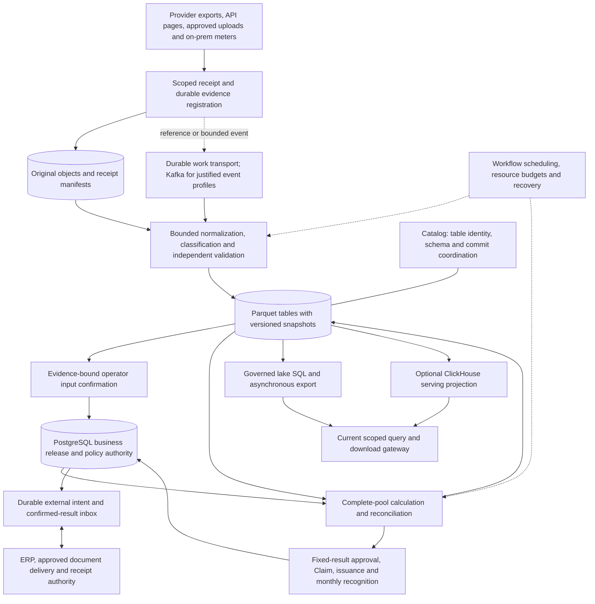

# Object storage centered data architecture

Tracking: [HB-20](https://linear.app/hybrid-billing/issue/HB-20/review-cost-data-architecture-for-over-100-million-records-per-day). Date: 2026-10-08. Accountable owner: Seung Woo Park. Root is sole writer; independent architect, DBA and QA review architecture, financial data and requirements respectively. This replaces the earlier conversational solution list as the proposed detailed direction. It does not declare implementation readiness or planning completion.

Owner constraints: original Hybrid Billing requirements remain; HawkEye/TokenMeter integration is deferred; more than 100 million incoming source records/day is a lower design condition; MongoDB is excluded; object storage and Parquet are the requested data foundation. SQL versus NoSQL is not the organizing boundary. SQL query capability, data model, file format, table metadata and storage service are different concerns.

The [43-group coverage review](../../reviews/HB-20-cost-data/full-review.md) identifies original requirements, shortcomings and unresolved gates. The [input inventory](../../reviews/HB-20-cost-data/input-inventory.json) fingerprints authorized local planning files, including unmerged HB-16 contracts and the original DOCX. Local contracts are review inputs, not silently merged source code or finalized customer policies. Earlier >1M/day source examples are superseded for current design sizing; historical source bytes remain unchanged.

## Proposed architecture and alternatives

**Recommendation for evaluation:** protected object storage holds originals and authoritative versioned analytical detail; Parquet is the processed columnar file format; an Iceberg table layer and a compatible catalog manage table metadata/snapshots; PostgreSQL holds business release/financial authority; Spark performs bounded batch transforms/calculation. Governed SQL reads pinned lake snapshots. ClickHouse is a separately built serving projection for measured interactive workloads, not a mandatory full duplicate of every retained byte. The open engineering gates below must close before adoption.

The diagram summarizes permitted responsibilities, not direct end-user DB/object access or a distributed transaction. All reads/writes use verified current scope. Original customer-facing features, XLSX workflow, manual/OCR evidence, intelligence, plugins and operations remain represented in the coverage review even when omitted from this data-path diagram.

| Layer | Proposed responsibility and candidate | Why / alternative |
| --- | --- | --- |
| Original evidence | Customer-operated durable object service; preserve permitted source JSON/CSV/Parquet and vendor generation manifest | Raw JSON is an object, not a document DB requirement. Object product, versioning, conditional operation behavior, encryption and recovery support must be certified. S3 API compatibility alone is insufficient. |
| Processed files | Parquet with pinned schema and exact numeric encoding contract | Columnar typed records, not arbitrary row documents. Native provider Parquet still undergoes source/semantic validation. |
| Table metadata | Iceberg as preferred comparison candidate, catalog with atomic conditional table commit | Plain Parquet plus application manifests would require maintaining schema evolution, snapshot/file discovery, compaction and safe GC ourselves. Delta/Hudi remain comparison alternatives, not installed parallel foundations. |
| Business publication | PostgreSQL ReleaseManifest, input confirmation, policy, approval and financial ledgers | Catalog's table head is not approved billing input. PG coordinates the approved multi-table release, separate from each catalog commit. |
| Processing | Spark batch jobs, bounded by source bytes/rows and complete economic pools | A single computation family initially; add a streaming engine only for demonstrated latency/state needs. No independent second money implementation inside SQL/BI. |
| Workflow | Airflow candidate for finite DAG scheduling; business jobs/status remain in core | DAG success is not validation or approval. Scheduler outage must not erase financial state. |
| Transport | Durable chunk/reference jobs; Kafka candidate for push/events, bursts or independent replay consumers | Bulk provider files may go directly from object receipt to referenced processing. No requirement to emit one Kafka message per CSV row. |
| SQL analysis | Governed lake SQL path; Trino is a comparison candidate | Broad historical/ad-hoc access and large exports from pinned lake snapshots. Selected catalog/format/features/row-column enforcement require versioned tests. |
| Interactive serving | ClickHouse projections for agreed UI query shapes | Add only the required dimensions/periods/aggregates; lake SQL is compared against the same query contract. No claim of instant drill-down over all history. |
| Financial core | PostgreSQL + ordinary authorized core commands/outbox | Financial uniqueness, approval, corrections, receipts and recognition stay transactional. |

Catalog product is unresolved, but its role is not optional: ownership, backup/restore, authentication, compatible protocol, conditional commits, table UUID resolution, upgrade compatibility and maintenance authority must have a named operator. A REST protocol is an interface, not a selected catalog deployment. If catalog metadata uses PostgreSQL, isolate catalog/application schemas, credentials and resource budgets; sharing a DB server does not make the two authorities atomically consistent.

Comparison gate: plain Parquet/custom manifests is the lower-dependency alternative but carries custom table-protocol responsibility; Iceberg is the preferred open multi-engine hypothesis; Delta and Hudi must be compared only on actual writer/read/delete/update/operational profiles. Do not import every feature or add all formats. Pin one tested format version and reader/writer compatibility set before activation.

## Storage zones and ownership

| Zone | Content / owner | Publication and access |
| --- | --- | --- |
| Receipt quarantine | Bounded received files/events pending validation; source module | Restricted, never directly customer-visible or billable; reject/exclude prohibited secrets or AI bodies before ordinary retained evidence publication. |
| Original evidence | Permitted immutable source bytes, generation manifest, digest, schema/profile reference | One collection per authoritative shared payer scope; customers receive derived authorized slices, never the raw shared object. |
| Canonical detail | Typed measurement, supplier/internal cost, effective mappings, component links and validation disposition | Snapshot identity and complete source manifest; analytical provisional use must be labeled and permitted, financial input requires full comparison and operator confirmation. |
| Calculated detail | Fixed policy/input-dependent charges, allocation/pricing pools and rule trace | Immutable run/result snapshots; no implicit approval. |
| Serving | Denormalized approved/provisional-labeled detail, aggregates and search projections | Rebuildable by explicit release; current authority, basis and completeness accompany every response/export. |
| Delivery | Issued documents, deterministic serialized ERP payloads, customer-specific XLSX/CSV/PDF | Approved artifact revision, disclosure check, hash/count/totals and revocation-controlled delivery. |

Object key patterns are operational routing hints, never authorization or economic identity. Use opaque scopes and run/object IDs rather than personal/customer names. Do not manually rename or delete table-managed data files. Financial references, correction dependencies and holds apply across zones.

## Concrete proposed datasets and row grains

The [cost fact proposal](cost-analytics-data-design.md) retains fact separation; this supplement adds original on-prem and Marketplace obligations and makes the snapshot model explicit.

| Dataset | One logical row | Required lineage / measure rules |
| --- | --- | --- |
| source_receipt | One provider generation/file/event receipt revision | Scope, authority, source mode, durable URI/version/digest, bytes, coverage, schema, status; not necessarily one PG row per measurement. |
| usage_fact | One canonical measurement slice with unit and source revision | Stable identity, interval, quantities and origin locator; monetary components do not duplicate quantity. |
| supplier_cost_fact | One provider economic cost component and basis | Cost/credit/fee/tax category, currency, billed/effective basis, source invoice/commitment evidence; quantities linked through explicit contribution relationships. |
| internal_cost_fact | One approved internal asset/cost input component for a period and basis | Depreciation/lease/power/facility/license/operations, owner and policy. Purchase principal and periodic depreciation are different bases; not additive period expense. |
| pricing_pool_manifest | One complete allowance/tier/minimum/commitment pricing scope and policy revision | All member identities/quantities, reset/window/unit, coverage and stable order when meaningful; no chunk-local allowance. |
| allocation_pool_manifest | One eligible cost pool, membership/weight/denominator revision | Original cost plus eligible residual/idle/MSP burden; approved algorithm and exact deterministic residual results. |
| allocation_fact | One pool component to one target | Currency/basis, applied share, residual category, algorithm and source contribution; original pool and allocation view are alternatives. |
| customer_charge_fact | One calculated contract/component/coverage item | Direct versus resale responsibility, price/discount/FX/tax policy revisions, input/result release, approval status through authority reference. |
| commitment_attribution | One supplier-reported commitment benefit/charge attribution | Purchased, applied, unused and fee components, commitment revision and evidence; accept provider RI/SP/CUD results, do not implement CSP amortization or optimization. |
| marketplace_flow | One distinct buyer/seller/intermediary component | Transaction role/channel/purpose, purchase expense, infrastructure cost, seller fee, settlement and eligible commitment amount remain separate measures. |
| recognition_fact | One entity/books/month/cost-basis posting component | Separate from customer invoice cadence, receipt and sales; original period and open-period correction links. |
| receipt_allocation_fact | One confirmed receipt application or reversal | Invoice, original external identity, currency and as-of; not automatically attributable to a resource. |
| dimension_revision | One effective/recorded revision of an account/resource/customer/org/contract mapping | Canonical identity and exact mapping revision; names are display only. |
| contribution_bridge | One typed source-to-result contribution | Explicit relationship type and amount/quantity share when defined; never a generic join that multiplies all facts. |

A denormalized analytical row includes stable scope/customer/account/service/resource IDs, selected dimension revision values, period, currency/basis and lineage IDs. This duplicates approved descriptive attributes to reduce expensive joins, not whole mutable profiles or all fact families in one mega-table. Historical labels/attribution remain fixed; restatement names a new selected mapping release. Current permission applies to both. Every common field has type, unit, nullability and semantic schema ID; unknown is distinct from zero/not-applicable.

Measurement profiles distinguish event deltas, cumulative counters, gauges and configuration intervals. Counter reset/replacement, gaps, estimates, GB/GiB, kW/kWh, time zones and interval splitting are explicit; never invent finer measurement resolution. Time-weighted rates/utilization and distinct resource counts have separate aggregation contracts.

FOCUS ingestion preserves incoming dataset/schema version separately from the internal target mapping. BilledCost, EffectiveCost, ListCost and ContractedCost are named alternative measures, separate from customer selling prices; format validity is not financial eligibility. Required completeness depends on the approved billing basis: independently priced sales may use complete eligible quantities while supplier cost stays unknown, and EffectiveCost need not reconcile to a same-month invoice.

Frequently filtered tags become typed curated columns only after meaning/type/cardinality review. Other tags are bounded map/extension values. Tag membership filters return each fact once; overlapping tag breakdowns are non-additive unless an approved allocation gives conserving shares. Key count, string size, nesting, dictionary/cardinality budgets and key promotion/backfill rules must be part of the physical schema contract. Define case normalization, duplicate-key policy, missing/null/empty distinctions and AND/OR membership semantics. Promotion includes versioned backfill and one authoritative interpretation; old extension values cannot conflict with the promoted column. Forbidden extension values must not leak via filters or counts. No blanket index on every provider field.

## Identity, schema and exact money

Each source profile chooses one approved identity mode: stable provider ID with explicit revision; canonical composite with verified uniqueness/multiplicity domain; or complete snapshot replacement of a defined economic scope with approved multiplicity rules. Otherwise the affected data remains quarantined. Payload hash is byte/content evidence, not proof that two equal-valued legitimate records are duplicates. File row ordinal, delivery ID, Kafka offset or run ID cannot reset economic identity. Changed decomposition preserves consumed economic coverage, or blocks when correspondence is ambiguous.

Maintain a schema registry binding schema ID to stable field IDs, names, types, meaning, units, null/default semantics, compatibility and effective profile versions. Nullable additive fields may be compatible only after all consumers agree; rename uses preserved identity where supported. Reusing a field ID for new meaning, changing unit/currency interpretation, or narrowing precision requires a new semantic revision and revalidation. Unknown provider columns remain preserved only when permitted; missing required fields quarantine affected scope. Historical snapshots keep their readable schema/decoder.

Exact numeric wire/storage contract must preserve the reviewed coefficient/scale semantics: source strings are parsed without float; Parquet decimal logical types are used only within a selected interoperable precision/scale profile; unsupported values fail or use an explicitly reviewed exact representation, never implicit string-to-float query conversion. Spark, lake SQL, ClickHouse and PG round trips, expression casts and aggregate intermediate growth must be verified on pinned versions. Check intermediate multiplication/sums before narrowing, even if signed cancellation makes the final number small. Financial consumers use authoritative precomputed components and reviewed exact grouping, not arbitrary ad-hoc formulas.

FX components retain original amount/currency, target currency, conversion purpose (sale/display/ERP), pair direction, quote unit/denominator, source/date, policy precedence, missing-rate fallback approval, normalized/composed rate and profile. Markup and conversion fees are separately identified. No second conversion of an already converted component and no display FX mutation of an issued sales amount. Original and converted views are alternative measures, not additive rows.

Pricing and allocation are separate complete-pool operations. A Spark partition or Parquet file is an execution unit, not the commercial pool. Pin full pool membership and denominator before splitting computation; verify complete results before publication. Visibility filters cannot shrink the denominator. Preserve exact rounding, tie order and residual rules from the local HB-16 Claim/numeric contract; its explicit finance policy values remain activation gates.

## Publication and concurrency protocol

Define one immutable BusinessReleaseManifest with release ID, scope/purpose, expected predecessor, source profile/mapping/policy/numeric/engine revisions, exact table UUID + snapshot ID + schema/partition-spec references for every participating table, object evidence digests, compatible control totals/counts, pool completeness, validation and operator-confirmation references. Financial approval pins the result release plus exact amount/coverage digest. A released manifest may reference unchanged partitions/snapshots; corrections do not copy all historical rows.

Proposed state sequence: RECEIVED -> STAGED -> TABLES_COMMITTED -> VALIDATED -> AWAITING_INPUT_CONFIRMATION -> ELIGIBLE_INPUT; calculated results follow a separate staged/validated/reviewable sequence, then financial approval/issuance. A catalog snapshot commit is not equivalent to either business eligibility or approval.

1. Source/processing workers stage immutable outputs under bounded execution credentials. Retry identity binds operation/input digest; no acknowledgment before the required durable receipt boundary.
2. The authorized table writer commits each table through the chosen catalog's conditional protocol and records returned snapshot identity. A timeout means unknown commit status: reconcile the same operation before starting another publication. No blind append.
3. A publication coordinator verifies all required snapshots/schema compatibility, bytes, identities, counts and exact compatible totals plus independent source comparison. All prerequisite pins/retention references must be reserved before eligibility to prevent concurrent GC.
4. Input-confirmation command rechecks current actor scope, expected release predecessor and evidence digest. A short PG transaction advances the business eligible pointer, dependency records, decision and outbox together. Concurrent publisher losers cannot replace the winner; they reconcile/revalidate their own candidate.
5. Calculation consumes exact release/policy/pool references, writes result snapshots and repeats verification. Approval/Claim/issuance use their existing distinct gates. Cross-table catalog commits, if supported, still cannot atomically include PG financial state or ClickHouse serving state.
6. Queries use the authorized BusinessReleaseManifest, never an unqualified latest table head or object folder listing. A serving release records source release and completeness. Missing/rebuilding serving data yields explicit stale/unavailable status or an authorized pinned lake route, never mixed old/new output. Each export pins its release set and rechecks permission at release/download.

One logical writer/coordinator owns a dataset mutation domain; multiple jobs may prepare disjoint candidates but only valid conditional commits publish. Maintenance is a separate privileged role using the same conflict/ref/pin rules. Lease expiry does not prove a writer stopped. Enforce generation fences at authority/catalog/object boundaries that support them and isolate stale writer credentials/network before recovery. Exact catalog fencing mechanism is an open mandatory compatibility gate.

Business releases pin multi-table snapshots regardless of optional catalog multi-table transaction support. PG/cross-store failure is not rolled back by choosing an old catalog head. An old verified analytical release can be explicitly historical/stale only; it cannot undo source eligibility, financial correction, revocation or deletion.

Initial correction hypothesis: copy-on-write replacement of bounded affected slices, batching compatible late corrections to control rewrites. This never rewrites all retained history or implies that rows absent from a partial source file were deleted. Compare row-level merge/delete only after exact writer/reader delete-file compatibility, compaction, exports and recovery are proven. Track bytes rewritten per corrected byte and retained-snapshot amplification.

## Financial uniqueness outside the lake

Source receipt deduplication, economic source identity, API retry identity and financial Claim are separate. Bulk source identity validation is performed across complete scoped releases, with canonical tuple comparison and multiplicity; hashes accelerate comparison but never replace collision handling.

The financial obligation tuple excludes transport/file/run/revision/partition reset dimensions. Reserve the entire declared overlap domain under canonical obligation lock order with expected revisions; pinned/unknown external outcomes survive worker expiry. Interval coverage and indivisible atoms, linked reversals and explicitly authorized replacement follow the HB-16 contract. All-or-nothing reservation is required within the declared multi-obligation application boundary.

Proposed first correctness boundary: a single logical transactional financial authority per supported installation/profile, with compact exact obligation/interval state and lake lineage references. Do not assume one obligation per incoming row or assume compact means small. Measure obligation cardinality, hot-domain lock duration and transaction size. If one operation cannot fit the proven boundary, block or redesign its explicit business boundary; do not silently split across shards with eventual overlap checks. Horizontal financial sharding is not selected by this review. Measure atoms/intervals per obligation, fragmentation, max application size, locks/deadlocks/retries, WAL and rebuild cost. Complete-snapshot sources can use exact sorted full-scope comparison; incremental events require exact durable identity/revision state. A stale derived identity index triggers a verified exact scan or quarantine, never acceptance as new. Expired replay identities make out-of-horizon input ineligible.

## Query routes, physical layout and field access

| Query class | Proposed route | Contract / physical evidence |
| --- | --- | --- |
| Current workflow/approval/document status | PG indexed scoped reads | Short bounded transactions and stable cursor; no raw-detail joins inside financial commands. |
| Repeated recent cost dashboards | Measured ClickHouse projection or equivalent lake aggregate comparison | Denormalized facts/limited aggregates; fixed currency/basis/release, exact totals. |
| Historical detailed analysis | Governed lake SQL over pinned snapshots | Partition/file/row-group pruning, bytes/time/concurrency budgets; asynchronous result if necessary. |
| Source-to-document drill-through | Lineage lookup -> scoped snapshot/file predicates | Canonical contribution ID and stored source locator; routing/index choice measured against sparse lookup. |
| Large XLSX/CSV/PDF delivery | Async file worker from permitted release | Preserve original common XLSX release requirement; split sheets/files under limits, exact machine values and totals, approved serialization and hashes. |
| Intelligence/forecast | Permission-aware features from named releases | Separate forecast/scenario facts; no authoritative money write, no hidden raw prompt/body ingestion or model training grant. |

Proposed physical hypotheses, not settings: coarse time transforms plus bounded account/workspace bucketing when skew measurements justify it; sort within files by dominant scope/time/service/resource access; separately route billing period and usage period. Compare file/row-group sizes against object requests, concurrency, selective reads, late correction and compaction. Define explicit targets only after representative row widths and access distributions exist.

Parquet column chunks/statistics and optional indexes, table manifests/partition transforms, SQL engine pruning and ClickHouse sort/projection/skip mechanisms are distinct. A field existing in JSON or a Parquet file is not proof of an efficient arbitrary-field lookup. Record which selected writer actually writes and which selected reader actually uses each pruning feature. Promote frequent predicates; bound expensive dynamic-key scans. Bloom/filter pruning is not a financial uniqueness constraint. User fields, generated SQL, casts and functions cannot bypass the semantic measure contract.

Analytical comparison must align grain, period, customer responsibility, currency and basis. Original supplier cost, internal cost, allocated cost, selling price, recognition, receipt and forecast are separate measures. Direct CSP purchasing can be shown/allocated but must not be resold as an MSP charge absent approved responsibility; sell only the eligible service components. Accept supplier-provided RI/SP/CUD effective results; no new CSP amortization/optimization scope. Marketplace buyer cost, infrastructure cost, seller fee/net settlement and commitment eligibility are not summed into one cost figure.

## Lake security, retention and recovery

Only scoped service identities reach catalog, SQL engines or object APIs. The public query gateway enforces permitted tables/rows/fields/functions before aggregation and before release. Restrict catalog enumeration, snapshot metadata/stats, object paths, preview/error text, SQL table functions/remote URLs, arbitrary credentials and exports; metadata itself can leak tenants or margins. Bound query bytes/time/concurrency and recheck long export access. Current workspace context cannot come from a path or a client-supplied filter. Privileged customer infrastructure administrators remain a documented trust boundary, not falsely protected by application masking.

Catalog, processing and maintenance have different credentials. Source fetch uses verified allowlisted destinations and redirect/audience policy. Operators cannot use maintenance authority as financial approval; AI/plugin execution cannot obtain raw lake/ledger credentials. Keep durable business/security audit independent of sampled telemetry. Raw originals containing shared payer evidence are never exposed through general signed download URLs.

Maintain a dependency graph from issued documents, approvals, input/results, pool/rule/FX snapshots and active readers to table snapshots/files/schema/keys. Pinning is registered with lifecycle authority before a release becomes usable and is serialized against deletion/hold changes. Snapshot expiration, orphan cleanup and compaction require both table reachability and business/hold/reader/writer checks. A file appearing orphaned during an unknown catalog commit is not eligible for deletion. Generic object-age TTL cannot remove managed-table files.

Mixed-customer or mixed-retention files require immediate logical denial, then a verified rewrite of retained rows where policy allows, new snapshot publication and removal of obsolete references under retention authority. Historical financial/hold dependencies may require keeping old files under restricted access; do not claim physical deletion when old snapshots, object versions, replicas or backups still retain rows. Immutability is a governed history property, not a promise never to perform approved retention deletion. Compaction preserves logical identity and retention age; it does not reset Claims, revoke history, or silently replace a financial snapshot.

Restore includes catalog metadata, table metadata/manifests/data/delete files, PG control/finance, keys and independent latest deletion/revocation watermarks. Fence old writers and outbound credentials, verify referenced snapshots and control continuity, reconcile catalog/PG unknown commits and ERP outcomes, then reopen permitted services. Time travel is not a backup, replication is not independent recovery, and an old backup cannot resurrect deleted access or economic availability.

## Capacity and activation gates

At 100 million/day: approximately 1,157 source rows/s evenly spread, 27,778/s if arriving in one hour, or 166,667/s in ten minutes; these are scenario arithmetic, not SLAs. A 30-day lower-bound window is 3 billion source rows, a 365-day window 36.5 billion before expansion. At an illustrative 1,000 bytes/raw row that is 100 GB/day decimal before compression, replication or processed copies; row width is unknown and the example is not storage sizing.

Track separate row/byte counts for source, normalized, monetary components, allocation fan-out, bridge edges, revisions and serving copies. Budget objects/GET/LIST requests, file/manifest/catalog growth, metadata planning time, shuffle/spill, compaction read/write amplification, exports, hot tenants, backups and recovery headroom. Catch-up needs effective processing above ongoing arrivals plus backlog divided by recovery window, in compatible units. Isolate live ingestion, close, backfill, query and maintenance admission budgets; merely adding workers cannot create storage throughput or supplier quota.

Required physical-selection gates: source profile identity/precedence/completeness; typed schema/field/numeric/FX contracts; selected format/catalog/engine compatibility including deletes and schema evolution; economic overlap enforcement at cardinality; lake query security; lifecycle/restore; peak/latency/close/catch-up/retention/RPO/RTO; real operators and self-hosted installation costs. Until those are verified, this is a reviewed logical proposal, not an implementable final physical design.

Performance, maintainability and operations alternatives are evaluated in the [comparison report](../performance-operations-comparison.md). Its acceptance matrix is required before adopting a physical configuration.

## Primary capability references

These support limited engine capabilities, not product test results. Exact release/feature compatibility remains an activation gate.

- [Parquet overview](https://parquet.apache.org/docs/overview/): columnar file format with implementation-dependent feature support.
- [Iceberg specification](https://iceberg.apache.org/spec/): table metadata and snapshots; it does not define this product's financial approval.
- [Iceberg maintenance](https://iceberg.apache.org/docs/latest/maintenance/): snapshot/file maintenance must be integrated with product dependencies and holds.
- [Trino Iceberg connector](https://trino.io/docs/current/connector/iceberg.html): a candidate lake SQL path, not a compatibility certificate for the chosen future catalog and engines.
