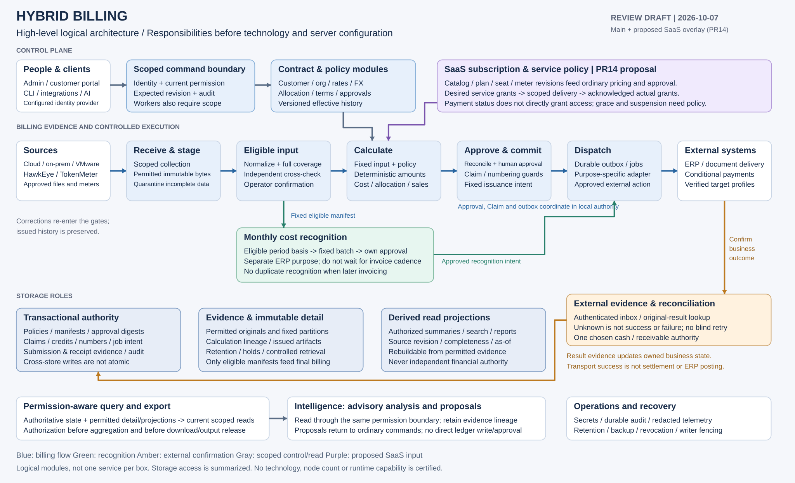
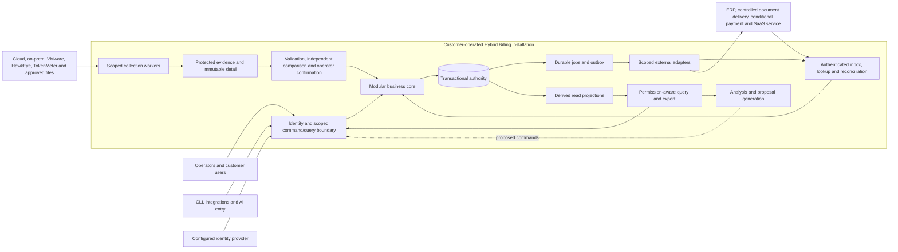

# High-level architecture

Date: 2026-10-07. Owner request: draw the high-level architecture before reviewing component data flows and fit-for-purpose configuration. Root owns synthesis; independent architecture/billing/security review is separate. Tracking: [HB-19](https://linear.app/hybrid-billing/issue/HB-19/document-high-level-architecture-and-component-data-flows-before). Accountable owner: Seung Woo Park. Execution machine: `machine:mac_mini`. This is a proposed design, not planning acceptance or product implementation. The previously untracked draft is now published through a ticket branch and independent review.

The static overview summarizes the boundaries and principal paths; the two Mermaid views and numbered contracts below supply the detailed relationships.

Baseline: repository main `e436a49424db7491140308f8c3895ce75cf176c3`. SaaS extension: [open PR #14](https://github.com/myblueton-sw/hybrid_billing/pull/14), head `6acb38c68117ff1f1865776aca00f87c61956196`; proposed separately from main. The original 43 requirement groups and 49 screen identities remain unchanged. Unpublished detailed planning inputs remain unavailable under the owner's prior instruction to proceed without those files. Planning completion has not been declared.

## Architectural direction

Use a **modular business core with separately scalable background workers**, one coordinated transactional authority, durable permitted evidence/detail snapshots, and derived read projections. The boxes below are logical responsibilities, not a commitment to microservices, separate servers or one database per module. The purpose of this review is to agree ownership and data movement before selecting technologies, deployment topology, schemas or capacity.

The core distinguishes supplier cost, customer selling charge and internal allocation. It also distinguishes billing calculations, source confirmation, human financial approval, document issuance, cash settlement, monthly ERP cost recognition and service access. No single status or aggregate can stand in for all these concepts.

## System context and trust boundary

Solid arrows describe permitted data/control relationships at context level, not unrestricted network access. The detailed flow IDs below identify the actual kind of movement. Every command, worker, query and external adapter rechecks current scoped authority; a queue or internal network does not grant trust. No user, AI agent or adapter has direct unrestricted storage access. An external service URL cannot select the workspace or credential audience.

## Billing and subscription flow

```mermaid
flowchart LR
    S[Source evidence] --> R[Receipt and quarantine]
    R --> N[Normalize, deduplicate and verify full coverage]
    N --> X[Independent cross-validation]
    X --> IC[Scoped operator input confirmation]
    IC --> M[Fixed eligible input manifest]
    P[Approved contract, rate, FX and allocation revisions] --> C
    M --> C[Deterministic allocation and charge calculation]
    C --> RC[Reconciliation and warning resolution]
    RC --> A[Human fixed-amount approval]
    A --> F[Authorized Claim and issuance/submission transaction]
    F --> O[Outbox and purpose-specific dispatch]
    O --> E[ERP, document or conditional payment adapter]
    E --> V[Authoritative external confirmation]
    V --> T[Transactional result and receipt allocation]
    M --> RB[Monthly cost recognition batch]
    P --> RB
    RB --> RA[Separate reconciliation and approval]
    RA --> O
    SC[SaaS contract and catalog revisions: PR14 proposal] --> P
    SC --> EP[Approved service entitlement policy]
    EP --> ED[Versioned desired grant and scoped delivery]
    ED --> ES[SaaS service acknowledgement: actual grant state]
```

The recognition path uses eligible source/calculation revisions on the required monthly basis; it does not wait for customer invoice cadence or begin Payment Terms. A recognized amount is not necessarily the customer selling amount. Purpose-specific ERP treatment prevents the later invoice from recognizing the same cost again. SaaS revenue/deferred-revenue policy is separately unresolved.

The entitlement path is not an invoice or payment side effect. Its policy can inspect sufficiently current contractual/payment evidence through authorized reads; desired state differs from confirmed applied state. Grace, suspension and reactivation are approved rules. A successful payment does not grant tenant access, and service expiry does not itself delete historical billing evidence.

Issued documents and confirmed posting history remain immutable. A correction creates new linked evidence and re-enters the applicable validation, calculation, reconciliation and approval gates, then produces an authorized adjustment/reversal with external confirmation rather than overwriting the original. Closed-period changes use approved open-period adjustments linked to the original attribution period. Invoice cancellation does not automatically cancel monthly recognition, reverse a receipt or trigger a cash refund; each affected authority and outcome is reconciled separately.

## Component responsibilities and configuration questions

| Component | Purpose, inputs and outputs | Authoritative owner and next configuration review |
| --- | --- | --- |
| Access and command/query boundary | Authenticate human/service identity, derive tenant/customer/action/field scope and accept bounded commands or permitted queries | Identity/access module owns grants, sessions and revocation. Review IdP, service credentials, command registry, segregation and propagation; no product selected. |
| Customer, contract and policy modules | Effective-dated Party/customer/org relationships, price/allocation/FX/tax rules and Payment Terms; proposed SaaS catalog/subscriptions | Core owns approved revisions and their activation. Review policy precision, effective-time overlaps, seat/meter definitions and approval ceilings. |
| Collection adapters/workers | API pulls, bounded uploads, push/events and controlled file ingestion; register permitted bytes, scope, identity and receipt state | Source module owns receipt/evidence metadata. Review provider capability profiles, credential audiences, quotas, checkpoint/coverage semantics and fetch policy. |
| Evidence and eligibility pipeline | Quarantine conflicts/incomplete input; normalize, verify source coverage, compare independent evidence and obtain operator confirmation | Input module publishes the eligible manifest only after all required checks. Review complete-snapshot/append/hybrid and cross-transport precedence. |
| Allocation and pricing workers | Fixed manifest plus approved policy revisions produces deterministic cost/allocation/selling components and lineage | Core owns calculation publication and approved results; workers cannot self-approve. Review decimal bounds, pools, rounding, correction and reproducibility. |
| Reconciliation and financial workflow | Explain differences, bind warning acknowledgments and human approval to exact evidence; reserve/apply economic Claims and authorize issuance | Financial authority coordinates approval digest, Claim consumption, numbering, document/submission intent and outbox atomically where local. Review reservation/concurrency and external uncertainty. |
| Recognition and receivable modules | Monthly cost batches, purpose-specific ERP comparison, confirmed receipts/reversals and due/overdue as-of | One selected external/manual receivable/cash authority per profile; platform holds linked evidence, not an independent bank ledger. Review books, basis, freshness and anti-double-recognition mapping. |
| Jobs, outbox/inbox and adapters | Dispatch approved immutable intent, lookup/reconcile external results, retry only safe unresolved work | Core owns durable intent and outcome; adapters own transport only. Review leases, bounded retries, ordering, idempotency, dead-letter/manual recovery and fencing. Broker is optional. |
| SaaS entitlements and payment adapters | PR14 proposal: contract/service policy produces versioned desired grants; processor and target service return authenticated evidence | Service delivery and payment are separate state machines. Review mandates, provider events, credit/refund conservation and acknowledgement; no automatic debit approval is implied. |
| Query, export and analytics | Build reproducible scoped views over fixed evidence and derived projections; disclose completeness and freshness | Query gateway enforces current permission before aggregation and output release. Review query shapes, storage/read workload, export revocation and hidden-field inference. |
| Intelligence | Detect anomalies and propose corrections/forecasts from permitted, traceable input | Derived advisory output only. Changes return through the same command/approval gates; models cannot calculate authoritative money or directly write ledgers. Review model/data boundary and evaluation. |
| Operations and governance | Secrets/key custody, durable business/security audit, redacted telemetry, dependency-aware retention and coherent recovery | Distinct operational/financial authority. Review holds, deletion watermarks, backup/restore, writer fencing and external reconciliation before reopening. |

## Storage roles

| Logical storage role | Contains | Must not be mistaken for |
| --- | --- | --- |
| Transactional authority | Tenant/permission/policy revisions, manifests, approved snapshots, Claims, reservations, numbers, financial evidence metadata, submission ledger, durable job/outbox/inbox state and audit records | A place for raw secret payloads or a claim that external payment/ERP transactions are locally atomic |
| Protected evidence/detail store | Permitted originals, fixed normalized/calculation partitions, source lineage, issued artifacts and retained versions | Arbitrary raw customer payload capture, temporary exports, or inputs automatically eligible merely because bytes exist |
| Derived read projections/cache | Versioned analytical views, search/reporting and operational summaries with source revision/completeness/as-of | Financial truth, a second receipt ledger, or a permission bypass; a projection may be rebuilt only from still-permitted retained evidence |

Metadata references immutable detail by manifest, digest and canonical economic identity. Stage and verify complete bytes before publishing authoritative eligibility; transactional publication and object writes are not a distributed atomic transaction. Read visibility follows authoritative manifest status. Orphan/stale artifacts remain noneligible until reconciliation and retention policy resolve them. A separate analytical store or broker must justify its operational cost with actual workload evidence.

## Numbered data-flow contracts

| ID / kind | From → to | Payload and gate | Failure or correction behavior |
| --- | --- | --- | --- |
| F01 command | User/client → access → owning core module | Current principal/scope, command, expected revision, idempotency key and bounded parameters | Reject stale/revoked/unauthorized commands; source caller's tenant parameter is not authority. |
| F02 evidence | Provider/file → collection → protected staging | Permitted bytes, provider/account/period, source identity, content hash and received time | Partial receipt stays incomplete; conflicting same identity is quarantined. No billing eligibility yet. |
| F03 publication | Staging/normalization → eligible input registry | Verified partitions/coverage, source modes, independent comparison and exact operator confirmation | Missing coverage or changed confirmed digest blocks publication; late evidence is a new linked revision. |
| F04 compute | Eligible manifest + approved policies → calculation | Fixed units/currencies/bases, complete allowance/allocation pools and exact engine/rule revisions | Same inputs reproduce amounts; overflow/undefined rules stop. Different chunks cannot reapply allowances. |
| F05 financial command | Reconciled result + human approval → financial authority | Fixed evidence/amount digest, current approver/issuer authority, economic Claim and intent | Changed inputs invalidate draft approval; concurrent runs cannot spend the same Claim/credit twice. Issued-history corrections use linked adjustments through the same gates, never overwrite. |
| F06 external intent | Committed outbox → adapter → ERP/document/payment target | Approved snapshot reference, purpose, target account/entity, correlation and idempotency identity | Timeout is unknown; lookup/reconcile original effect before redispatch. Transport receipt is not business completion. |
| F07 result evidence | External target → authenticated inbox/lookup → core | External document/attempt identity, verified state/amount/currency/as-of and linked original intent | Validate audience/signature as applicable; wrong-account/conflicting/out-of-order events cannot settle another invoice. |
| F08 recognition | Eligible period evidence → approved monthly batch → ERP adapter | Separate entity/books/basis/period and purpose-specific submission; linked net adjustments | Missing months are unknown; invoice does not create recognition again without verified offset/reversal/reference treatment. Closed-period corrections post authorized open-period adjustments linked to original history. |
| F09 SaaS state | Subscription/service policy → entitlement outbox → target → acknowledgment | PR14 proposal: desired grant revision, current scope and separate confirmed applied revision | Stale events cannot regrant access; delivery unknown is visible; no inferred refund or invoice cancellation. |
| F10 read | Authority/detail → projections → authorized query/export → user | Fixed source revision, permitted fields/rows, currency/basis, completeness and as-of | Permission applied before aggregation and at release; stale projection cannot authorize financial commands. |
| F11 proposal | Authorized query → intelligence → ordinary command request | Evidence-linked anomaly/correction proposal or labeled forecast | No direct financial/storage write or automatic approval; training requires its own approved contract. |
| F12 recovery/control | Retention/revocation authority → restore/replay/dispatch | Latest independent control watermarks, held dependencies and active writer generation | Fence old writers; prevent data/access resurrection and reconcile external uncertainty before reopening. |

## Review conclusions and decisions to make next

The published logical direction is suitable as a review starting point because it separates financial authority, bulk evidence processing and read workloads. This is a design inference, not performance or compatibility proof. Keep the first architecture choice at module/data-ownership level; an arrow or box does not establish a deployable microservice.

Review in dependency order:

1. Approve or revise module responsibilities, permitted flows and external trust boundaries, including the PR14 SaaS proposal.
2. Specify transaction boundaries, input publication, economic uniqueness, correction/reconciliation and entitlement/payment state contracts.
3. Define exact command/event/query envelopes and source/target capability profiles, with independent monetary and tenant-isolation acceptance cases.
4. Measure arrival bursts, record/detail expansion, monthly close, correction/replay, query concurrency, retention and catch-up requirements; existing >1M records/day is a premise, not a node-sizing answer.
5. Compare storage, queue, cache and worker configurations against those responsibilities; then choose VM/container or customer-operated Kubernetes placement and recovery topology.
6. Reconcile the full requirement/work/API/screen/acceptance trace and obtain the owner's explicit planning completion before implementation.

No language, framework, database product, broker, cloud service, node count, operating budget or SLA is selected here. Existing PostgreSQL/ClickHouse/Kafka/OpenTelemetry assessments remain candidate analysis. Full provider scope and customer-operated delivery are preserved.

## Source and verification record

Source documents read from the repository baseline: [readiness](architecture-readiness.md), [technology](technology-assessment.md), [installation](self-hosted-installation-assessment.md), [collection](data-collection.md), [billing ownership](data-ownership/billing-data-model.md), [administration](admin-design.md), [intelligence](intelligence-layer.md), [input/pricing/ERP contracts](../contracts/billing/inputs-pricing-and-erp.md), [payment/recognition](../contracts/billing/payment-and-recognition.md) and [security](../contracts/security/access-and-trust.md). The HB-18 supplement is read from the separately proposed PR14 head identified above. This is synthesis of repository evidence, not a new external standards/vendor audit.

Browser access to the actual Hybrid Billing workspace was restored before formal publication; HB-19 ownership, project, status and machine claim were read back there. Earlier connector failure is not evidence that the workspace was absent. Missing companion rules, skills, `.linear.json`, detailed planning inputs, artifact policy and planning gate remain unavailable on this machine. The owner's explicit instruction to proceed without the other-local files permits this bounded documentation work; their contents are not reconstructed or certified.

Independent review, publication checks and limits are recorded in the [HB-19 verification report](../reviews/HB-19-high-level-architecture/verification.md). Runtime, financial execution, security enforcement, provider/ERP compatibility, load/recovery, user-task and accessibility validation are NOT_RUN. Final policy values, exact command contracts and physical design remain unresolved.
