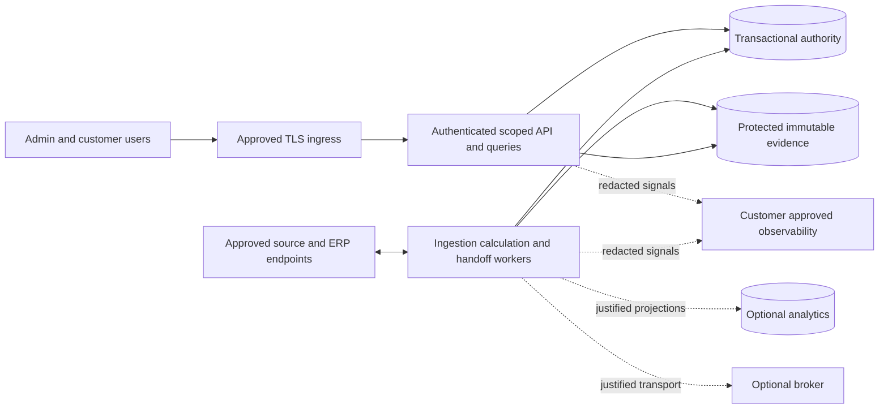

# Self-hosted installation assessment

Tracking: [HB-12](https://linear.app/hybrid-billing/issue/HB-12/assess-kubernetes-versus-vm-installation-for-self-hosted-operations). Accountable owner Seung Woo Park; root PM/planner and sole writer; independent architecture, DBA and QA reviewers. Official sources checked on 2026-10-01. This is a design assessment; installation, compatibility and failure experiments are **NOT_RUN**. The owner has not declared planning complete; no charts, manifests, installers or infrastructure are created here.

## Conditional recommendation

**Prefer a Kubernetes application profile when the customer already operates a supported production cluster with named operators. Retain a VM/container comparison profile when that operating capability is absent. Creating a new cluster solely for billing needs a separately justified benefit, funded ownership and recovery evidence.** This is an inference from operating responsibilities and product requirements, not a measured cost advantage or final adoption decision. Neither profile is certified. VMware is optional underlying infrastructure, not a prerequisite for Kubernetes billing collection or installation.

Decide application placement separately from stateful placement. First compare using compatible customer-operated transactional DB and evidence storage; their existence alone does not establish support. Compare an in-cluster DB/operator only if its operational ownership and recovery evidence justify the added lifecycle. Do not bundle Kafka or ClickHouse into every installation; their [technology assessment](technology-assessment.md) remains conditional.

| Application profile | Fit and benefit to verify | Added ownership / limitation |
| --- | --- | --- |
| Existing customer-operated Kubernetes | Established release, scheduling, monitoring and maintenance processes; independently scalable API/workers | Customer compatibility, capacity, CNI/CSI, admission and support constraints; app team still owns financial correctness and data recovery |
| VM/container installation | Candidate where established VM operations and few operators favor fewer orchestration dependencies | Service supervision, repeatable releases, isolation, resource limits, HA and recovery still need explicit design; a single VM is not an HA solution |
| Newly operated Kubernetes cluster | Candidate only where lifecycle/availability/scale benefits outweigh creating cluster operations | Separate cluster bootstrap, control-plane/etcd, nodes, certificates, CNI/CSI, security, upgrades, backup and incident work; no unmeasured savings claim |

## Proposed placement and boundaries

Boxes are logical roles, not one microservice or deployment per box. For a future Kubernetes profile, API and suitable long-running workers are Deployment candidates; separate workers where resource, failure or credential boundaries warrant it. A controlled migration task must acquire the approved schema authority and maintenance gate, never run independently at every application startup. Version compatibility and actual workload controllers remain unselected. [Deployments](https://kubernetes.io/docs/concepts/workloads/controllers/deployment/) manage replica rollout; this does not prove safe schema migration.

Scheduled/batch work may use Jobs, but a Job's program can start twice even with single completion/parallelism settings. **Business exactly-once effects require the existing economic Claim, durable outbox/checkpoint and concurrency/fencing contracts.** Controller completion, pod identity and broker offsets are not financial identity. Drain or restart must preserve uncertain external outcomes and reconcile before resend. [Jobs](https://kubernetes.io/docs/concepts/workloads/controllers/job/), [financial contract](../contracts/billing/inputs-pricing-and-erp.md).

| Stateful role | Candidate placement | Evidence needed before support |
| --- | --- | --- |
| Transactional authority | Compatible customer DB, or separately assessed VM/DB operator | Constraints/concurrency, failover fencing, DB-aware backup/PITR, coherent restore and migration ownership |
| Immutable evidence and snapshots | Approved durable object/file service inside or outside cluster | Bytes/checksums/manifests, encryption/key custody, retention/hold/deletion, retrieval and independent recovery destination |
| Optional analytics/broker | Customer service or separately owned deployment | Replay/rebuild correctness, resource/disk/quorum budgets, retention, upgrades and recovery; replicas/offsets cannot replace financial history |
| Cluster configuration and etcd | Cluster team's operational domain | Independent control-plane restore and credentials/configuration recovery; this backup is not the application DB/evidence backup |

## Verified mechanics and design implications

| Primary-source fact | Implication for this platform |
| --- | --- |
| [Production Kubernetes](https://kubernetes.io/docs/setup/production-environment/) requires ongoing administration, availability planning, certificates, upgrades and etcd backup; one control-plane machine is a failure point | Select real independent failure domains for control plane, workers and data. Several VMs on one hypervisor/storage system do not establish independent availability. No node count is derived from daily records |
| [StatefulSet](https://kubernetes.io/docs/concepts/workloads/controllers/statefulset/) provides stable identity/storage associations | It does not by itself provide database replication, consistency, fencing or backup. An operator adds its own version, CRD, privilege and upgrade responsibilities |
| [Persistent volumes](https://kubernetes.io/docs/concepts/storage/persistent-volumes/) have access modes and reclaim policy; ReadWriteOnce concerns a node, not exclusive database writer identity | Review CSI and backing storage, reclaim/deletion behavior and retention holds. A mounted PV or generic snapshot is not evidence of an approved financial restore |
| [Force-deleting StatefulSet pods](https://kubernetes.io/docs/tasks/run-application/force-delete-stateful-set-pod/) can violate identity safety when the old instance still runs | Verify old-writer fencing before promotion/replacement; deleting the API object is insufficient |
| [Disruption budgets](https://kubernetes.io/docs/concepts/workloads/pods/disruptions/) constrain supported voluntary evictions, not involuntary failure, direct deletion or controller rolling updates | Review rollout limits and financial worker checkpoints separately; a PDB is not an uptime or exactly-once guarantee |
| [NetworkPolicy](https://kubernetes.io/docs/concepts/services-networking/network-policies/) depends on a supporting network implementation and does not handle TLS | Prove enforcement, DNS/egress and approved destination/TLS/credential behavior. Namespace/network isolation cannot replace product tenant/row/query authorization |
| [RBAC guidance](https://kubernetes.io/docs/concepts/security/rbac-good-practices/) warns that workload creation can expose service-account/secrets privileges | Installer permissions must be explicit and scoped; no implicit cluster-admin or customer-infrastructure upgrade. Infrastructure administrators remain a trust boundary and do not acquire product financial approval rights |
| [Horizontal autoscaling](https://kubernetes.io/docs/concepts/workloads/autoscaling/horizontal-pod-autoscale/) uses periodically observed metrics and resource requests for utilization targets | Autoscaling needs spare capacity and measured queues; it does not create DB/upstream quota or safe parallel ERP issuance |

PostgreSQL PITR needs a base backup and continuous archived WAL, with separately managed configuration. Set measurable RPO/RTO and archive continuity before acceptance. [PostgreSQL continuous archiving](https://www.postgresql.org/docs/current/continuous-archiving.html). Cluster recovery concerns its own data; see [etcd operations](https://kubernetes.io/docs/tasks/administer-cluster/configure-upgrade-etcd/). These are distinct recovery scopes.

Restore must recover coherent authority and referenced evidence, isolate old writers/external credentials, preserve uncertain ERP Claims, and load the latest independent denial/deletion/training-withdrawal controls before reopening. Unknown control freshness means quarantine. Do not keep the only current control or backup/key copy within the same failed/restored boundary. Apply the [access/trust contract](../contracts/security/access-and-trust.md) and [usage lifecycle](usage-detail-lifecycle.md).

## Installation, upgrades and operational ownership

Proposed packaging is immutable version-pinned application images plus reviewed configuration and, if the Kubernetes profile is selected, a separately implemented installation package such as Helm. Preflight must check supported OS/CPU/runtime or distribution/version, available resources, admission/service-account permissions, CNI/CSI/storage classes, ingress/TLS/DNS/time, DB/schema/evidence compatibility, backup/key access, and allowed destinations. Offline delivery is conditional on customer policy and must include the complete approved dependency/image/digest bundle without hidden public downloads. No supported distribution, operator or Helm version is selected here.

Use compatibility-gated migrations, maintenance/traffic controls and rehearsed recovery. [Helm rollback](https://helm.sh/docs/helm/helm_rollback/) restores a release revision; the inference for billing is that package rollback cannot reverse database schema/data or external economic effects. Expand/contract compatibility or an explicitly gated alternative is required; an incompatible mixed release halts. Do not automatically downgrade data or replay unknown external requests.

| Responsibility | Requested owner; not a completed assignment |
| --- | --- |
| Cluster or VM lifecycle, nodes, network/storage, certificate renewal, infrastructure incidents | Customer infrastructure/operations owner |
| Application package, job fencing, compatibility, migration and diagnostic runbooks | Product engineering/release owner with customer operations |
| Database/operator failover, WAL/backup, evidence/key recovery, retention execution | DBA/storage/security owners with explicit boundaries and escalation |
| Financial authority, reconciliation and reopening after uncertain outcomes | Finance owner; infrastructure access is not financial approval |
| Support scope, upgrade windows, on-call staffing, budget and acceptance | Accountable owner obtains named customer/product responsibilities |

Compare total cost with equal business/data/availability targets: infrastructure and storage/backup/replication, licenses/support, network and registry, operator setup/on-call/patch/upgrade/recovery hours, downtime and migration risk. Include external DB/evidence costs in every applicable profile. Existing infrastructure's incremental cost and total service cost must be shown separately. No staffing, sizing, budget or cost estimate is currently verified.

## Comparable acceptance plan

All cases below are **NOT_RUN** and require planning completion followed by an authorized installation/validation ticket. Compare the same application/DB versions where possible, immutable synthetic workload, component roles/state placement, currency oracles, failure objectives and resource budgets. Record unavoidable differences instead of attributing them to the orchestrator.

| ID | Required experiment and pass evidence |
| --- | --- |
| KO-01 | Repeatable scoped installation and offline package preflight; missing dependencies/permissions fail visibly without hidden downloads |
| KO-02 | Current tenant/query/worker authorization and credential/destination isolation; infrastructure role cannot act as financial approver |
| KO-03 | Sustained/burst ingestion with closing, queries, exports, corrections and retention; agreed latency/backlog budgets and independent counts/currency totals |
| KO-04 | Redelivery, duplicate Jobs, restart and concurrency preserve one economic effect, unique Claims and durable manifests/checkpoints |
| KO-05 | Drain/node partition/failure before and after receipt/publication/dispatch; fence old workers, retain uncertain state and reconcile without blind resend |
| KO-06 | Storage full/unavailable/corrupt/reattach; backpressure or explicit uncertainty, no false durable acknowledgment or lost/truncated evidence |
| KO-07 | Authority/network/control outage; fail closed on sensitive outputs, stale cache/restart cannot revive revoked authority |
| KO-08 | Mixed/interrupted release and migration; compatible continuation or safe halt, no destructive-schema recovery claim from image rollback |
| KO-09 | Coherent DB/evidence restore meets agreed RPO/RTO; independent latest controls/keys, old-writer fencing and no deleted/withdrawn-data resurrection |
| KO-10 | Crash/timeout around ERP or document delivery preserves immutable keys and unknown outcomes without duplicate economic effects; retries/retransmission require verified endpoint idempotency or explicit reconciled/manual handling, with channel limits recorded |
| KO-11 | Named operators perform install/upgrade/incident/recovery runbooks; measure intervention hours, alerts, support boundary and unresolved escalations |
| KO-12 | Decision packet records exact supported versions, resources, operating cost, failures and unsupported combinations; scores cannot conceal money/security failures |

## Decision inputs still required

The customer's actual cluster/VM environment, distribution/version, CNI/CSI/admission/storage restrictions, CPU architecture, available fault domains and resources, existing data services, disconnected/egress conditions, operators/on-call ownership, burst/query/closing workload, SLO/RPO/RTO, maintenance windows and budget are unknown. The lower-bound daily record premise does not answer them.

Use HB-11 [D-01 scope/ownership and D-05 capacity/recovery](../reviews/HB-11-refinements/resolution.md) decisions plus the installation acceptance packet before selecting the first supported profile. This assessment does not close the thirteen planning refinements, canonical trace integration or the owner gate. Current result: source-backed conditional suitability reviewed; actual installation and operational suitability **UNVERIFIED**. See [HB-12 verification](../reviews/HB-12-kubernetes/verification.md).
